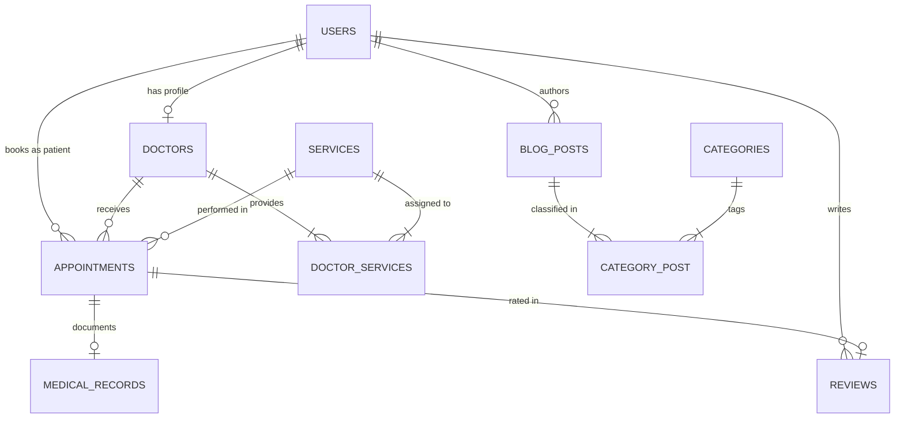

# DentCare — Enterprise Dental Clinic Management System

[](https://laravel.com)
[](https://php.net)
[](https://mysql.com)
[](https://tailwindcss.com)
[](https://pestphp.com)
[](https://laravel.com/docs/sanctum)

A production-ready, full-stack **Dental Clinic Management & Online Booking System** built with **Laravel 13**, **PHP 8.4**, and **MySQL**. Engineered to showcase enterprise-level software craftsmanship for a **Senior Backend PHP/Laravel Developer** portfolio.

Featuring real-time slot conflict prevention, multi-role RBAC (Admin, Doctor, Patient), layered Service-Repository architecture, bilingual localization (Arabic RTL & English LTR), REST API V1, and comprehensive automated test coverage.

---

## 🌟 Key Features

### 1. High-Precision Real-Time Appointment Engine
- **Mathematical Slot Breakdown**: Dynamic time slot generation derived from clinic working hours, service duration, booking intervals, and active bookings.
- **Double Booking Prevention**: Atomic database transactions (`DB::transaction`) with pessimistic locking and validation preventing concurrent race conditions.
- **Strict Clinical Constraints**:
  - Automatically respects weekly clinic working hours and closed days (e.g., Fridays).
  - Enforces `minimum_notice_hours` (e.g., 2 hours before visit) to eliminate instant walk-in conflicts.
  - Limits booking horizon with `maximum_days_ahead` (e.g., 30 calendar days).
  - Enforces patient self-cancellation cutoff rules (`cancellation_hours`).

### 2. Multi-Role Portals & Strict Authorization (RBAC)
- **Admin Dashboard**: Full CRUD for Doctors, Patients, Clinical Services, Appointment Lifecycle, Medical Records, Review Moderation, Blog Posts, Categories, Clinic Image Gallery, FAQs, Inquiries, and Operating Hours.
- **Doctor Portal**: Doctor dashboard with daily schedule overview, patient history lookups, appointment status progression, and direct clinical diagnosis / treatment note logging.
- **Patient Portal**: Patient self-service hub, live booking wizard, real-time appointment status tracking, self-service cancellation, clinical diagnosis history, verified review submissions, and instant notifications.

### 3. Public Website & UI/UX
- **Modern Responsive Design**: Clean medical aesthetics using tailored color palettes, subtle typography, and micro-interactions.
- **Bilingual & Native RTL Support**: Instant switching between English (LTR) and Arabic (RTL) across public pages and management panels.
- **Interactive Multi-Step Booking Wizard**: Filter by specialty, choose doctor, select service, inspect live available slots via AJAX, and confirm booking.

### 4. RESTful API V1 for Mobile & Third-Party Apps
- Standardized JSON responses (`success`, `message`, `data`, `meta` / `errors`).
- Secured via **Laravel Sanctum** token-based authentication.
- Endpoints for mobile authentication, services listing, doctor schedules, slot calculations, appointments booking, and contact submissions.

---

## 🏗️ Architectural Pattern

The application strictly implements **Clean Layered Architecture** with **Thin Controllers**:

```
HTTP Request / API Call
       │
       ▼
   Route Middleware (SetLocale, RoleMiddleware, Sanctum)
       │
       ▼
   Controller (Delegates only — no business logic)
       │
       ▼
   Form Request (Strict validation & sanitization)
       │
       ▼
   Service Layer (Business rules, calculations, DB transactions)
       │
       ▼
   Repository Interface (Contract defining query boundaries)
       │
       ▼
   Repository Implementation (Eloquent ORM queries & eager loading)
       │
       ▼
   Eloquent Model (Relationships, scopes, casts, accessors)
       │
       ▼
   Database (MySQL) / API Resource (JSON Envelope) / Blade View
```

### Directory Structure Overview
```
app/
├── Enums/                     # Type-safe PHP 8.4 Enums (UserRole, AppointmentStatus, Gender, etc.)
├── Http/
│   ├── Controllers/
│   │   ├── Admin/             # Admin management controllers
│   │   ├── Api/V1/            # Standardized REST API controllers
│   │   ├── Doctor/            # Doctor workflow controllers
│   │   └── Patient/           # Patient self-service controllers
│   ├── Middleware/            # RoleMiddleware, SetLocaleMiddleware
│   ├── Requests/              # Dedicated FormRequests per action
│   └── Resources/Api/         # Standardized Eloquent API Resources
├── Models/                    # Rich Eloquent Models with relationships & scopes
├── Notifications/             # In-app and multi-channel notification classes
├── Policies/                  # Granular authorization policies
├── Repositories/
│   ├── Contracts/             # Interfaces (IoC abstractions)
│   └── Eloquent/              # Eloquent implementations
└── Services/                  # Core Business Services (AppointmentService, DoctorService, etc.)
```

---

## 🗄️ Database Schema & Relational Design

The system relies on 20 relational database migrations engineered with foreign key constraints, cascaded deletions where appropriate, and indexed lookup fields:



---

## 🛡️ Default Demo Accounts

All roles are seeded with realistic data for immediate testing:

| Role | Email | Password | Access Area |
| :--- | :--- | :--- | :--- |
| **Super Admin** | `admin@dentcare.com` | `password` | `/admin` |
| **Consultant Doctor** | `doctor1@dentcare.com` | `password` | `/doctor/dashboard` |
| **Implant Surgeon** | `doctor2@dentcare.com` | `password` | `/doctor/dashboard` |
| **Cosmetic Specialist** | `doctor3@dentcare.com` | `password` | `/doctor/dashboard` |
| **Registered Patient** | `patient1@dentcare.com` | `password` | `/patient/dashboard` |

---

## 🚀 Installation & Local Setup

### Prerequisites
- **PHP** >= 8.4
- **Composer** >= 2.8
- **MySQL** >= 8.0
- **Node.js** (Optional for local asset compiling; Tailwind CSS CDN & Alpine.js CDN are pre-bundled)

### Step-by-Step Setup

1. **Clone the repository**:
   ```bash
   git clone https://github.com/yourusername/dentcare.git
   cd dentcare
   ```

2. **Install PHP dependencies**:
   ```bash
   composer install --no-interaction
   ```

3. **Configure Environment**:
   ```bash
   copy .env.example .env
   php artisan key:generate
   ```

4. **Configure Database**:
   Update `.env` with your MySQL credentials:
   ```env
   DB_CONNECTION=mysql
   DB_HOST=127.0.0.1
   DB_PORT=3306
   DB_DATABASE=dentcare
   DB_USERNAME=root
   DB_PASSWORD=
   ```

5. **Run Migrations & Complete Seeders**:
   ```bash
   php artisan migrate:fresh --seed
   ```

6. **Create Public Storage Symlink**:
   ```bash
   php artisan storage:link
   ```

7. **Start the Application**:
   ```bash
   php artisan serve
   ```
   Visit [http://localhost:8000](http://localhost:8000) in your browser.

---

## 🧪 Automated Test Suite

The project includes an automated test suite written in **Pest PHP** covering authentication, appointment engine constraints, authorization policies, Admin CRUD, and REST API V1 endpoints.

### Running Tests
```bash
php artisan test
```

### Test Coverage Highlights:
- **`AuthTest.php`**: Patient registration, role-based login redirections, credential validation, and admin route protection.
- **`AppointmentBookingTest.php`**: Available slot lookups, atomic booking creation, double-booking race condition prevention, Friday closure checks, and cancellation cutoff limits.
- **`AuthorizationPolicyTest.php`**: Cross-patient record isolation, doctor schedule isolation, and permission boundaries.
- **`AdminCrudTest.php`**: Doctor onboarding, service management, review moderation, and clinic operating rules configuration.
- **`ApiV1Test.php`**: RESTful services, doctor slot query API, Sanctum bearer token issuance, and authenticated booking submissions.

---

## 📱 RESTful API V1 Reference

### Authentication
- `POST /api/v1/auth/register` — Register new patient account
- `POST /api/v1/auth/login` — Authenticate and receive Sanctum bearer token
- `POST /api/v1/auth/logout` — Revoke token *(Bearer required)*
- `GET /api/v1/me` — Authenticated profile details *(Bearer required)*

### Public Endpoints
- `GET /api/v1/services` — List all active services
- `GET /api/v1/services/{service}` — Service details
- `GET /api/v1/doctors` — List all active specialists
- `GET /api/v1/doctors/{doctor}/available-slots?date=YYYY-MM-DD&service_id=X` — Live available booking slots
- `GET /api/v1/reviews` — Approved patient reviews
- `GET /api/v1/blog` — Published dental health articles
- `GET /api/v1/faqs` — Frequently asked questions
- `POST /api/v1/contact` — Submit visitor inquiry

### Authenticated Patient Endpoints *(Bearer token required)*
- `GET /api/v1/appointments` — List patient's bookings
- `POST /api/v1/appointments` — Book new appointment slot
- `GET /api/v1/appointments/{appointment}` — Appointment details
- `DELETE /api/v1/appointments/{appointment}` — Cancel appointment
- `POST /api/v1/reviews` — Submit verified doctor review

---

## 🎨 Code Quality & Standards

- **PSR-12 & Laravel Pint**: Formatted and verified with `vendor/bin/pint --format agent`.
- **PHP 8.4 Features**: Constructor property promotion, First-class callable syntax, strict typing (`declare(strict_types=1)`), and native Backed Enums.
- **Thin Controllers**: Zero Eloquent queries or business logic inside controllers.
- **Eager Loading**: All relational queries prevent N+1 query performance degradations.

---

## 📄 License
This project is open-sourced software licensed under the [MIT license](LICENSE).
